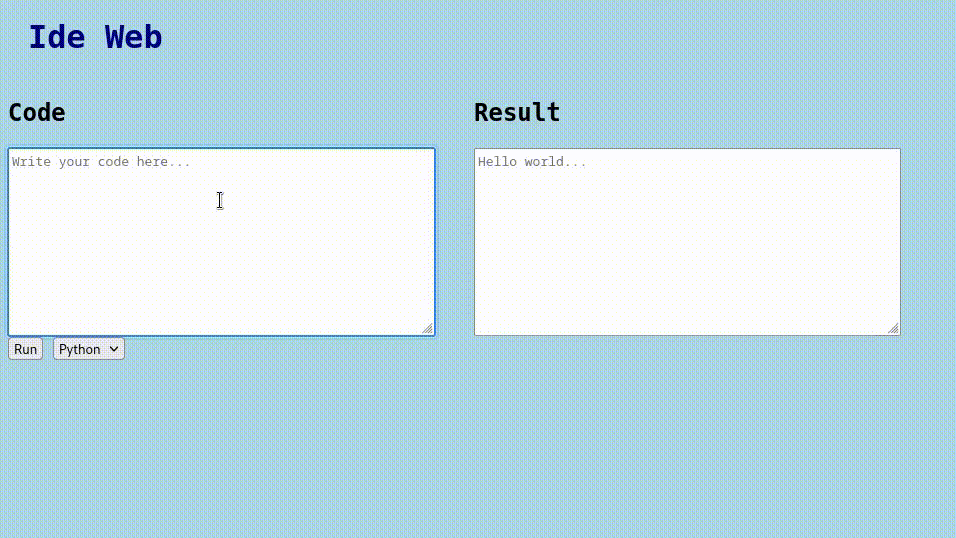

# REST API LANG
This aplication is a REST API for run the language:
- Python
- C++
- Coming soon...
You can view a the documentation on 

## Run the app
On the terminal
```bash
uvicorn main:app --reload
```
This open the API on port 8000 in [http://127.0.0.1:8000](http://127.0.0.1:8000). You can view a autogenerated documentation on route [/docs](http://127.0.0.1:8000/docs).

## Sample page
Open `example/index.html` on the browser.



## Request a code

### Request
Requesting a python's code.
```python
x = input()
print(x)
```
with input
```
I'm a input\n
```
Pass code and input to base 64 on this [page](https://www.base64decode.org/).

`POST /run/`

    curl -X 'POST' \
    'http://127.0.0.1:8000/run/' \
    -H 'accept: application/json' \
    -H 'Content-Type: application/json' \
    -d '{
    "language": "python",
    "code": "eCA9IGlucHV0KCkKcHJpbnQoeCk",
    "input_source": "SSdtIGEgaW5wdXQ"
    }'

### Response

    access-control-allow-credentials: true  
    access-control-allow-origin: http://127.0.0.1:8000  
    content-length: 53  
    content-type: application/json  
    date: Fri,08 Jul 2022 02:31:06 GMT  
    server: uvicorn  
    vary: Origin 

    {
    "exit status": 0,
    "result": "I'm a input\n",
    "error": ""
    }
